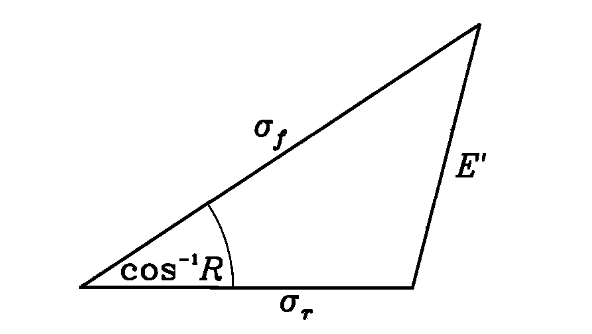
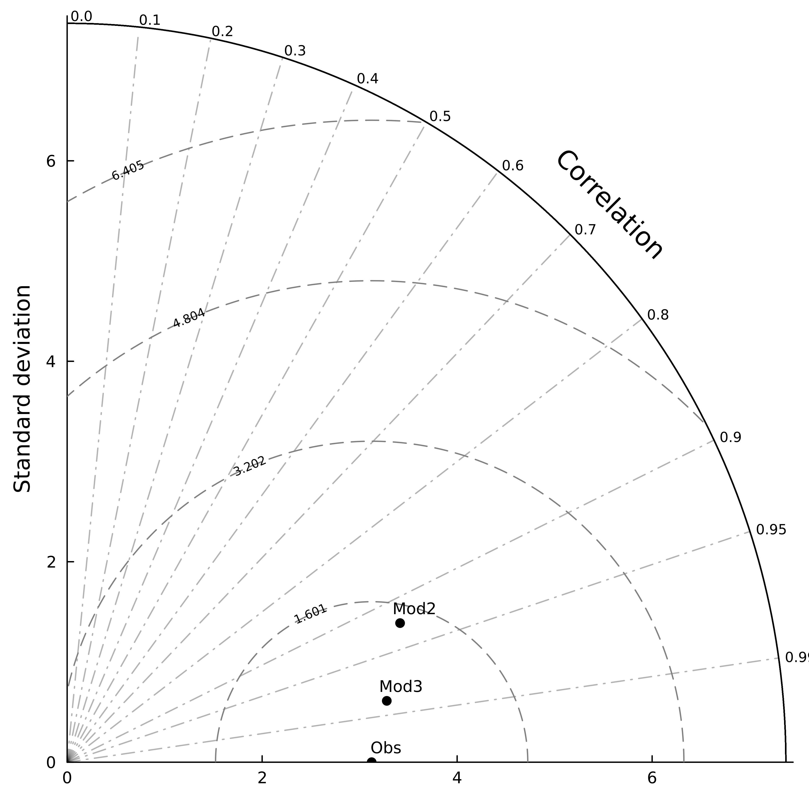

# TaylorDiag

[](https://github.com/SimonTreillou/TaylorDiag.jl/actions/workflows/CI.yml?query=branch%3Amain)

## What is a Taylor diagram

A Taylor diagram is a diagram designed by Karl E. Taylor [[1]](#1),  indicating the realism of models/representations. It is a really powerful tool because of the information displayed in a single diagram: the correlation coefficient (quantifying the  pattern similarity between reference and model), the RMSE (quantifying the difference, without differentiating difference due to pattern and difference due to amplitude) and standard deviation (quantifying the amplitude and deviation). This diagram is well-known in earth sciences and climate sciences (e.g. oceanography, meteorology) but would benefit from being known in others scientific fields.

Given $f$ and $r$ two variables, $r$ being the reference, and $\sigma_f$ and $\sigma_r$ their respective standard deviations, the correlation coefficient R reads as : 

$$ R = \frac{ \frac{1}{N} \sum_n (f_n - \bar{f}) (r_n - \bar{r})}{\sigma_f \sigma_r}$$ 

The RMS difference E reads as :

$$E = [ \frac{1}{N} \sum_n (f_n - r_n)^2 ]^{1/2}$$

and can be separated in two parts : $E^2 = \bar{E}^2 + E'^2$. $\bar{E} = \bar{f} - \bar{r}$ is the overall bias and the centered pattern RMS difference $E'$ is :

$$\sqrt{E'} = \frac{1}{N} \sum_n [(f_n - \bar{f}) - (r_n - \bar{r})]^2$$

Taylor (2001) then showed that these scores are related using the following equation :

$$E'^2 = \sigma^2_f + \sigma_r^2 - 2 \sigma_f \sigma_r R$$



$From \space Taylor \space (2001) - Figure  \space 1$

## How to use

You first need to add the package to your library.

```julia
using Pkg
Pkg.add("https://github.com/SimonTreillou/TaylorDiag.jl.git")
using TaylorDiag
``` 

## Example

```julia
using Random
using TaylorDiag

# We first build observations (e.g. reference) using random distribution
obs = 10*rand(10)

# Then we build "modeled" datasets (here the observations with random noise)
mod = obs + rand(10)*4
mod2 = obs + rand(10)*2

# We compute standard deviations (S), root mean squared deviations (R)
# and correlations (C)
S = [STD(obs),STD(mod), STD(mod2)]
R = [RMSD(obs,obs),RMSD(obs,mod), RMSD(obs,mod2)]
C = [COR(obs,obs),COR(obs,mod),COR(obs,mod2)]

# We then plot the Taylor diagram, here without special names added
taylordiagram(S,C)

# Here with special names added (plot not shown)
names = ["Data1", "Data2", "Data3"]
taylordiagram(S,C,names)

# Here with automatic computation of the standard deviations 
# and correlation coefficients (plot not shown)
taylordiagram([obs,mod,mod2])

# Here with automatic computation of the standard deviations 
# and correlation coefficients, and special names (plot not shown)
taylordiagram([obs,mod,mod2],names)
```




## Roadmap

- [x] Statistics tests
- [x] Write functions descriptions
- [x] Add reference
- [x] Write quick-quick documentation on the README
- [x] Clean-up
- [x] Add plotting options
- [ ] List what next: see reference


## Contributing

Contributions are welcome. Please make a pull request so the community can enjoy it!

See contributor's guide badge for more informations: ColPrac: Contributor's Guide on Collaborative Practices for Community Packages.


## References

<a id="1">[1]</a> 
Taylor, K. E. (2001). 
Summarizing Multiple Aspects of Model Performance in a Single Diagram
Journal of Geophysical Research: Atmospheres 106, nᵒ D7 (2001): 7183‑92. https://doi.org/10.1029/2000JD900719.
